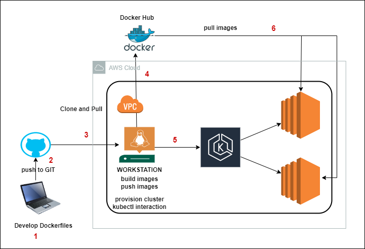

### EKS Install

*NOTE:* This is for the lab purpose, not for PROD purpose.

### How to provision EKS Cluster?

Below software are mandatory to provision EKS Cluster.

* Eksctl
* AWS CLI V2
* Kubectl

We can create one EC2 Server and use it as work station to create EKS cluster.



#### Steps:

* Create IAM Admin user with CLI access, It generates Access Key and Secret Key.
**Don't keep this in any version control like Github, Gitlab, etc.**
* Install AWS CLI, by default AWS instance gets V1, We need to upgrade to V2.
```
curl "https://awscli.amazonaws.com/awscli-exe-linux-x86_64.zip" -o "awscliv2.zip"
unzip awscliv2.zip
sudo ./aws/install --bin-dir /usr/local/bin --install-dir /usr/local/aws-cli --update
```
Logout and Login again.
* Install latest eksctl command.
```
curl --silent --location "https://github.com/weaveworks/eksctl/releases/latest/download/eksctl_$(uname -s)_amd64.tar.gz" | tar xz -C /tmp

sudo mv /tmp/eksctl /usr/local/bin

eksctl version
```
* Install kubectl command maxium one version less than EKS version.
```
curl -O https://s3.us-west-2.amazonaws.com/amazon-eks/1.24.10/2023-01-30/bin/linux/amd64/kubectl
chmod +x kubectl
sudo mv kubectl /usr/local/bin/kubectl
```

eksctl is the popular tool to provision EKS cluster. We make use of spot instances to save the cost.


# spot-cluster.yaml
```
apiVersion: eksctl.io/v1alpha5
kind: ClusterConfig

metadata:
  name: spot-cluster
  region: ap-south-1

managedNodeGroups:

# `instanceTypes` defaults to [`m5.large`]
- name: spot-1
  spot: true
  ssh:
    publicKeyName: my-ec2-keypair
```
To create cluster with above config file.
```
eksctl create cluster --config-file=[file-name].yaml
```
**NOTE:** Don't forget to delete the cluster.
```
eksctl delete cluster --config-file=[file-name].yaml
```